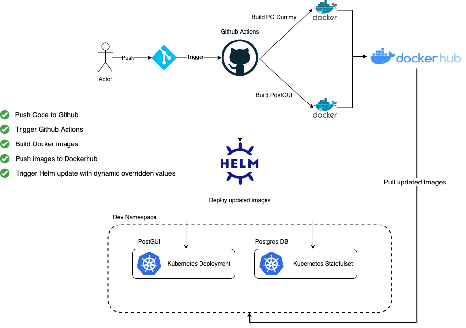

# alcatraz
## Pod checker usage
---
Checks readiness status of specified pod

```shell
Options:
  --namespace                 Target namespace, uses 'default' if omitted
  --labels                    Lables can be passed in case you want to select another pod in the namespace, uses 'app.kubernetes.io/name=ui' if omitted
```
## CI-CD Workflow 

